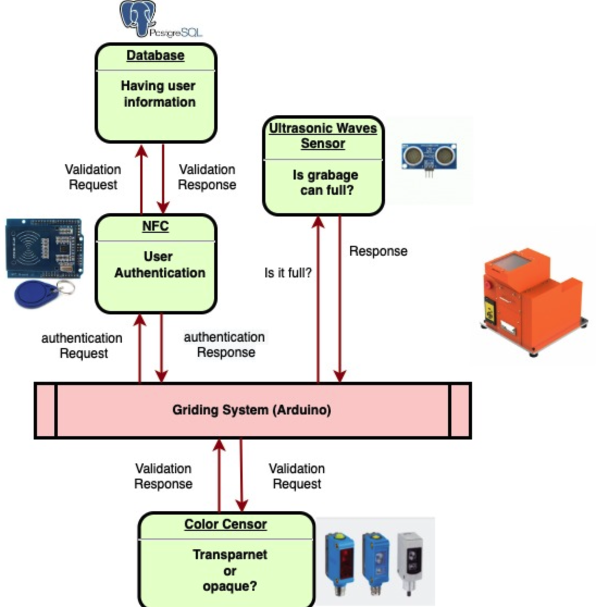

# 22.10.16

11일 동안 시험공부에 밀려 뒷전이 된 TIL을 그동안 공부한 내용들을 기록하고자 합니다.

> 데이터베이스&#x20;

* 과제에서 조건에 따른 SQL문을 작성해보며, 부속 질의문과 조인, 외래키와의 연결 등 데이터베이스에 대한 구조를 익히는 시간이였습니다.

> 이동통신 프로토콜

* 지그비에서 비콘, 비 비콘 기반 네트워크 데이터 전송 모델
  * 코디네이터와 디바이스 간 통신
*   블루투스 통신방법

    * 마스터와 슬레이
    * cSkip

> 스마트 휴먼라이프 디자인

* 월요일에 발표할 스마트 휴먼라이프 디자인에서 진행하는 플라스틱 분쇄쓰레기통에 대한 프로젝트 구상도를 작성하였습니다.

#### 돌아보며..

저를 언제나 채찍질하는 동엽이에게 고마우며, 귀찮다고, 시험기간이라고 시간없다는 핑계로 해야할 일을 뒷 전으로 미루지 않겠습니다.
